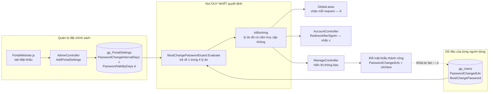
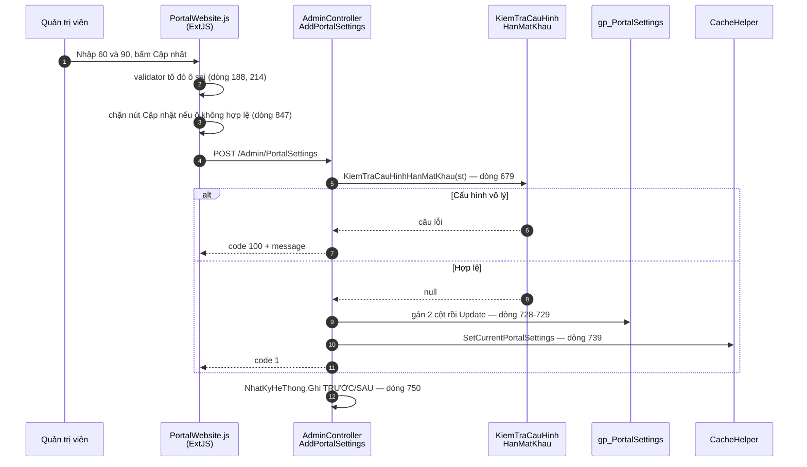
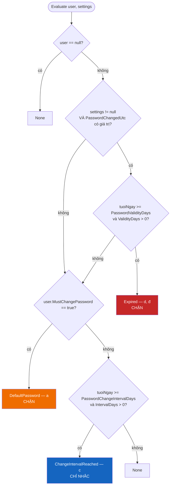
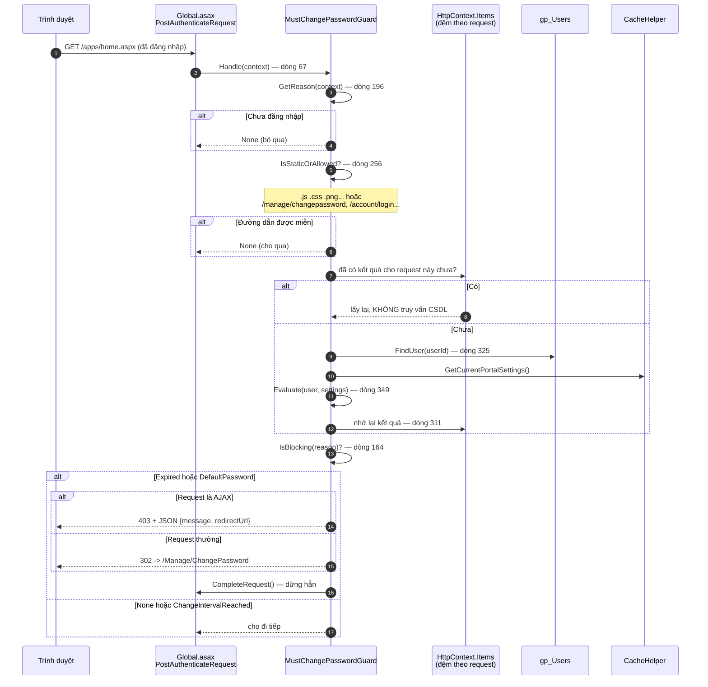
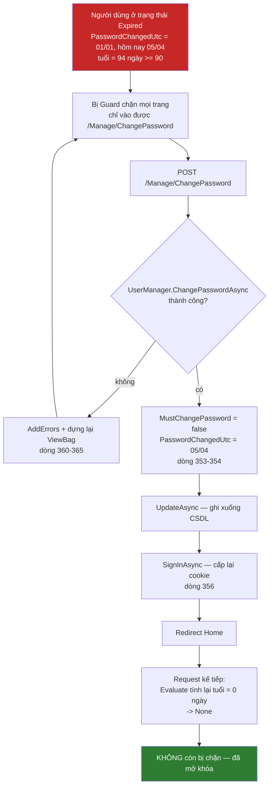

# 01 — Mật khẩu định kỳ, hết hiệu lực, khóa và mở khóa

## Yêu cầu nghiệp vụ

| Mã | Nội dung | Hiện thực bằng |
|---|---|---|
| (a) | Buộc đổi mật khẩu khi tài khoản đang dùng mật khẩu do quản trị cấp | cột `gp_Users.MustChangePassword` |
| (c) | Có chức năng cho phép thiết lập **thời gian yêu cầu thay đổi** mật khẩu | cột `gp_PortalSettings.PasswordChangeIntervalDays` |
| (d) | Có chức năng cho phép thiết lập **thời gian mật khẩu hợp lệ** | cột `gp_PortalSettings.PasswordValidityDays` |
| (đ) | **Khóa** tài khoản và yêu cầu nhập mật khẩu mới khi mật khẩu hết hạn hợp lệ | tính ra từ `gp_Users.PasswordChangedUtc`, thực thi ở `MustChangePasswordGuard` |
| (e) | **Mở khóa** tài khoản khi đổi mật khẩu thành công | gán lại `PasswordChangedUtc` trong `ManageController.ChangePassword` |

Tài liệu này đi theo đúng thứ tự một dữ liệu chạy trong hệ thống: **khai báo ở
đâu → ai ghi vào → ai đọc ra → đọc xong thì làm gì**. Mỗi đoạn mã đều kèm
**đường dẫn tệp và số dòng**, **ai gọi nó**, và **vì sao phải gọi ở chỗ đó chứ
không phải chỗ khác**.

!!! note "Quy ước đường dẫn"
    Mọi đường dẫn tính từ gốc kho mã `D:\dev\gPortal`. Ba thư mục hay gặp:

    - `gPortal_Portal/gPortal/` — ứng dụng web (MVC + WebForms)
    - `gPortal_Portal/gPortal.Framework/` — tầng dữ liệu, Identity
    - `gPortal_gClient/gPortalAdmin/` — giao diện quản trị viết bằng ExtJS

    Số dòng đúng tại thời điểm viết tài liệu; nếu lệch thì tìm theo **tên hàm**
    ghi kèm.

---

## 0. Bản đồ 30 giây

Toàn bộ tính năng gồm **ba cột dữ liệu**, **một hàm luật**, và **ba nơi gọi
hàm luật đó**. Không có job nền, không có cột trạng thái khóa.



Bốn chữ cần nhớ ngay từ đầu, vì mọi thứ sau đây dựa trên chúng:

> **Trạng thái khóa không được lưu ở đâu cả — nó được TÍNH ra.**

---

## 1. Ba cột dữ liệu: khai báo ở đâu

### 1.1. `gp_Users.PasswordChangedUtc` — mốc để tính tuổi mật khẩu

**Thuộc tính C#** — `gPortal_Portal/gPortal.Framework/Identity/IdentityModels.cs:52`

```csharp title="gPortal_Portal/gPortal.Framework/Identity/IdentityModels.cs:52"
public DateTime? PasswordChangedUtc { get; set; }
```

**Cột CSDL** — `gPortal_Portal/Database/DbUpdate.sql:153`

```sql title="gPortal_Portal/Database/DbUpdate.sql:153"
ALTER TABLE dbo.gp_Users ADD PasswordChangedUtc DATETIME NULL;
```

**Tác dụng:** đây là **mốc gốc**. Cả (c), (d) và (đ) đều chỉ là phép trừ
`UtcNow - PasswordChangedUtc` rồi so với một ngưỡng. Không có cột này thì không
có tính năng nào trong tài liệu này.

**Vì sao phải là `DateTime?` (cho phép NULL) —** ghi rõ trong chú thích ở
`IdentityModels.cs:44-51`:

- Nếu khai `DateTime` thường, Entity Framework **luôn** đưa giá trị vào câu
  `INSERT` kể cả khi code quên gán, và giá trị đó là `0001-01-01`.
- `0001-01-01` nằm **ngoài dải** của kiểu `DATETIME` trong SQL Server (bắt đầu
  từ 1753) → hoặc lỗi lúc tạo người dùng, hoặc (nếu đổi sang `DATETIME2`) mốc
  năm 0001 → tuổi mật khẩu **2000 năm** → tài khoản bị khóa ngay lập tức, âm
  thầm, không có thông báo lỗi nào.

**NULL nghĩa là gì —** đây là chỗ dễ hiểu sai nhất:

> `NULL` = **KHÔNG áp dụng hết hạn**, **không** phải "rất cũ".

Chọn như vậy vì hậu quả hai hướng không cân nhau: khóa nhầm một người dùng hợp
lệ gây thiệt hại tức thì và lan rộng; bỏ sót một tài khoản chưa hết hạn thì hại
ít hơn nhiều. Xem nguyên tắc 3 trong [README](README.md).

**Hai lớp bảo vệ độc lập** — `DbUpdate.sql:140-151`:

| Lớp | Ở đâu | Làm gì |
|---|---|---|
| 1 | `DbUpdate.sql:164-167` | Backfill `GETUTCDATE()` cho mọi người dùng đang có, để họ có mốc thật thay vì NULL |
| 2 | `MustChangePasswordGuard.cs:353` | Gặp NULL thì **bỏ qua** toàn bộ nhánh hết hạn |

Chỉ có lớp 1 thì bất kỳ người dùng nào lọt qua với NULL (import dữ liệu, tạo
bằng SQL tay, code quên gán) sẽ bị khóa vĩnh viễn mà không rõ lý do.

Câu backfill cũng đáng nhìn kỹ:

```sql title="gPortal_Portal/Database/DbUpdate.sql:164-167"
UPDATE dbo.gp_Users
SET PasswordChangedUtc = GETUTCDATE()
WHERE PasswordChangedUtc IS NULL;   -- chỉ chạm dòng còn NULL
```

Mệnh đề `WHERE` không phải để tối ưu tốc độ — nó để **chạy lại script lần thứ
hai không ghi đè** mốc thời gian thật của những người đã đổi mật khẩu.

### 1.2. Hai cột cấu hình (c) và (d)

`gPortal_Portal/Database/DbUpdate.sql:170-186`

```sql title="gPortal_Portal/Database/DbUpdate.sql:170-186"
ALTER TABLE dbo.gp_PortalSettings ADD PasswordChangeIntervalDays INT NULL;  -- (c)
ALTER TABLE dbo.gp_PortalSettings ADD PasswordValidityDays       INT NULL;  -- (d)
```

| Cột | Ý nghĩa | NULL nghĩa là |
|---|---|---|
| `PasswordChangeIntervalDays` | (c) Bao nhiêu ngày thì **nhắc** người dùng đổi | tắt tính năng nhắc |
| `PasswordValidityDays` | (d) Bao nhiêu ngày thì mật khẩu **hết hợp lệ** | tắt tính năng khóa |

Ràng buộc nghiệp vụ: `PasswordValidityDays >= PasswordChangeIntervalDays`.
Ràng buộc này **không** được đặt ở CSDL mà đặt ở tầng ứng dụng — xem mục 2.3.

---

## 2. Yêu cầu (c) và (d) — chức năng thiết lập

Đây chính là hai yêu cầu "có chức năng cho phép thiết lập". Chúng là **một
đường dữ liệu đi từ màn hình xuống CSDL**, có ba chốt kiểm tra trên đường đi.



### 2.1. Màn hình nhập liệu

`gPortal_gClient/gPortalAdmin/app/view/Website/PortalWebsite.js:177-224`
— tab **"Mật khẩu"** (`title: 'Mật khẩu'` ở dòng 139).

```javascript title="gPortal_gClient/gPortalAdmin/app/view/Website/PortalWebsite.js:180-190"
// dòng 180-190 — ô (c)
xtype: 'numberfield',
fieldLabel: 'Thời gian yêu cầu đổi mật khẩu (ngày)',
emptyText: 'Để trống = không yêu cầu đổi định kỳ',
bind: '{record.PasswordChangeIntervalDays}',
reference: 'PasswordChangeIntervalDays',
minValue: 1,
allowBlank: true,
validator: function (value) {
    return PortalWebsiteKiemTraHanMatKhau(this, value, 'dinhky');
},
```

- `bind` nối ô nhập với thuộc tính cùng tên trên bản ghi → giá trị tự chảy vào
  JSON gửi lên server, không phải đọc thủ công.
- `reference` là **tên để tìm ô kia**. Cần nó vì luật kiểm tra nằm giữa **hai
  ô**, không nằm trong một ô.
- `allowBlank: true` vì để trống là **hợp lệ** — nghĩa là tắt tính năng.

### 2.2. Luật kiểm tra viết một lần, dùng cho cả hai ô

`PortalWebsite.js:18-46` — hàm `PortalWebsiteKiemTraHanMatKhau`.

**Ai gọi:** cả hai ô, qua `validator` (dòng 189 và 215), truyền vào tham số
`vaiTro` là `'dinhky'` hoặc `'hople'` để hàm biết mình đang đứng ở ô nào.

```javascript title="gPortal_gClient/gPortalAdmin/app/view/Website/PortalWebsite.js:29-45"
var coMinh = !trong(giaTri);              // ô đang xét có giá trị không
var coKia  = !trong(oKia.getValue());     // ô còn lại có giá trị không

if (coMinh === coKia) {
    if (!coMinh) return true;             // cùng trống -> tắt tính năng, hợp lệ
    return hopLe >= dinhKy || 'Thời gian hợp lệ phải lớn hơn hoặc bằng ...';
}
return '...phải đặt cả...';               // một có một không -> sai
```

**Vì sao viết chung một hàm:** hai bản luật viết tay sẽ có ngày lệch nhau. Ở
đây chỉ có một bản, hai ô gọi cùng nó.

**Một chi tiết ExtJS dễ quên** — `PortalWebsite.js:191-201`:

```javascript title="gPortal_gClient/gPortalAdmin/app/view/Website/PortalWebsite.js:191-201"
listeners: {
    change: function (field) {
        var oKia = field.up('form') || field.up('panel');
        oKia = oKia && oKia.down('[reference=PasswordValidityDays]');
        if (oKia) oKia.validate();      // chạy lại validator của ô KIA
    }
}
```

Ràng buộc nằm **giữa hai ô**, nên sửa ô này có thể làm ô kia từ sai thành đúng.
ExtJS **không** tự chạy lại validator của ô kia. Không gọi tay thì vệt đỏ đứng
lại ở trạng thái cũ và **nói dối người dùng**.

**Chốt thứ hai phía giao diện** — `PortalWebsite.js:847-862`, trong hàm lưu:

```javascript title="gPortal_gClient/gPortalAdmin/app/view/Website/PortalWebsite.js:847-862"
var oHanMatKhau = [refs.PasswordChangeIntervalDays, refs.PasswordValidityDays,
                   refs.SessionWarnBeforeMinutes];
for (var i = 0; i < oHanMatKhau.length; i++) {
    var o = oHanMatKhau[i];
    if (!o || o.isValid()) continue;
    Ext.toast({ html: (o.getErrors() || [])[0] || '...' });
    return;                              // không gửi request
}
```

**Vì sao cần:** `validator` chỉ **tô đỏ** ô nhập, nó **không** ngăn được nút
Cập nhật. Thiếu vòng lặp này thì cấu hình vô lý vẫn được gửi đi.

**Vì sao kiểm cả hai ô:** ràng buộc "cùng điền hoặc cùng trống" có thể bị vi
phạm ở ô Định kỳ trong khi ô Hợp lệ vẫn thấy mình hợp lệ. Chỉ hỏi một ô là bỏ
lọt đúng một nửa số trường hợp sai.

### 2.3. Chốt thật ở server

`gPortal_Portal/gPortal/Controllers/AdminController.cs:800-821`

**Ai gọi:** `AddPortalSettings` tại **dòng 679**, tức là **trước cả hai nhánh
thêm mới và cập nhật**.

```csharp title="gPortal_Portal/gPortal/Controllers/AdminController.cs:800-821"
private static string KiemTraCauHinhHanMatKhau(gp_PortalSettings st)
{
    bool coDinhKy = st.PasswordChangeIntervalDays.HasValue;
    bool coHopLe  = st.PasswordValidityDays.HasValue;

    if (coDinhKy != coHopLe)
        return "Thời gian yêu cầu đổi mật khẩu và thời gian mật khẩu hợp lệ "
             + "phải cùng được thiết lập, hoặc cùng để trống.";

    if (!coDinhKy) return null;                       // cùng trống -> tắt

    if (st.PasswordChangeIntervalDays.Value <= 0 || st.PasswordValidityDays.Value <= 0)
        return "... phải lớn hơn 0 ngày.";

    if (st.PasswordValidityDays.Value < st.PasswordChangeIntervalDays.Value)
        return "Thời gian mật khẩu hợp lệ phải lớn hơn hoặc bằng thời gian yêu cầu đổi.";

    return null;
}
```

**Vì sao phải lặp lại luật đã có ở ExtJS:** gọi thẳng API thì **mọi thứ trong
ExtJS đều bị bỏ qua**. Đây là nguyên tắc 2 trong [README](README.md): kiểm tra
ở giao diện là trải nghiệm, không phải bảo mật.

**Ba tình huống bị chặn và hậu quả nếu cho phép:**

| Trường hợp | Nếu cho lưu thì sao |
|---|---|
| Chỉ có (c), thiếu (d) | Người dùng bị nhắc nhưng **không có hạn chót nào** → chính sách chỉ còn là lời khuyên |
| Chỉ có (d), thiếu (c) | Tài khoản bị khóa đột ngột mà **chưa hề được nhắc lấy một lần** — tệ nhất |
| (d) < (c) | Bị khóa **trước cả khi** kịp được nhắc |

**Lợi ích kiến trúc:** chặn ngay ở tầng lưu thì `MustChangePasswordGuard` chỉ
còn phải xử lý đúng **một hình dạng dữ liệu** — hoặc cả hai cùng có giá trị
dương với `d >= c`, hoặc cả hai cùng NULL.

### 2.4. Lưu xong thì làm gì

`AdminController.cs:726-729` — gán vào bản ghi:

```csharp title="gPortal_Portal/gPortal/Controllers/AdminController.cs:726-729"
// (c) và (d): thời gian yêu cầu đổi mật khẩu và thời gian mật khẩu còn hợp lệ.
// NULL = tắt tính năng.
settings.PasswordChangeIntervalDays = st.PasswordChangeIntervalDays;
settings.PasswordValidityDays       = st.PasswordValidityDays;
```

`AdminController.cs:739` — làm mới bộ nhớ đệm:

```csharp title="gPortal_Portal/gPortal/Controllers/AdminController.cs:739"
CacheHelper.SetCurrentPortalSettings(settings);
```

**Tác dụng:** `MustChangePasswordGuard` đọc cấu hình qua
`CacheHelper.GetCurrentPortalSettings()`. Không cập nhật đệm ở đây thì admin sửa
90 → 60 ngày mà hệ thống vẫn dùng số cũ cho tới khi đệm hết hạn.

`AdminController.cs:698` và `750-754` — ghi nhật ký kèm giá trị **trước và sau**:

```csharp title="gPortal_Portal/gPortal/Controllers/AdminController.cs:698 và 750-754"
string cauHinhCu = TomTatCauHinhBaoMat(PortalSettingManager.FindDefault());  // dòng 698
...
NhatKyHeThong.Ghi(LoaiNhatKy.ThayDoiCauHinh, "SUA_CAU_HINH_BAO_MAT",
    "Cập nhật cấu hình bảo mật của Website",
    thanhCong: res.code == "1",
    chiTiet: "TRƯỚC: " + cauHinhCu
             + Environment.NewLine + "SAU: " + TomTatCauHinhBaoMat(st));
```

**Vì sao phải chụp `cauHinhCu` ở dòng 698, trước khi ghi đè:** sau khi gán ở
dòng 728 thì giá trị cũ **không còn tồn tại ở đâu nữa**. Nhật ký chỉ nói "ai đó
đã đổi cấu hình" thì biết cũng như không; thứ người kiểm toán cần là **đổi từ
gì sang gì**.

---

## 3. Bộ não: `Evaluate` — nơi duy nhất quyết định

`gPortal_Portal/gPortal/Authorization/MustChangePasswordGuard.cs:349-382`

Đây là hàm quan trọng nhất trong toàn bộ tính năng. Nó **thuần túy**: nhận vào
người dùng và cấu hình, trả về một lý do. Không đụng `HttpContext`, không đọc
CSDL, không ghi gì cả — nên đọc được và kiểm chứng được.



Mã nguồn tương ứng:

```csharp title="gPortal_Portal/gPortal/Authorization/MustChangePasswordGuard.cs:349-382"
public static PasswordChangeReason Evaluate(ApplicationUser user, gp_PortalSettings settings)
{
    if (user == null) return PasswordChangeReason.None;

    if (settings != null && user.PasswordChangedUtc.HasValue)
    {
        // PasswordChangedUtc là NULL -> KHÔNG áp dụng hết hạn.
        double tuoiNgay = (DateTime.UtcNow - user.PasswordChangedUtc.Value).TotalDays;

        // (d, đ) Hết thời gian hợp lệ -> khóa. Kiểm tra TRƯỚC vì nặng hơn.
        if (settings.PasswordValidityDays.HasValue
            && settings.PasswordValidityDays.Value > 0
            && tuoiNgay >= settings.PasswordValidityDays.Value)
            return PasswordChangeReason.Expired;
    }

    // (a) Mật khẩu mặc định do quản trị cấp.
    if (user.MustChangePassword) return PasswordChangeReason.DefaultPassword;

    if (settings != null && user.PasswordChangedUtc.HasValue)
    {
        double tuoiNgay = (DateTime.UtcNow - user.PasswordChangedUtc.Value).TotalDays;

        // (c) Tới hạn thay đổi định kỳ.
        if (settings.PasswordChangeIntervalDays.HasValue
            && settings.PasswordChangeIntervalDays.Value > 0
            && tuoiNgay >= settings.PasswordChangeIntervalDays.Value)
            return PasswordChangeReason.ChangeIntervalReached;
    }

    return PasswordChangeReason.None;
}
```

### 3.1. Bốn giá trị trả về

`MustChangePasswordGuard.cs:12-28` — enum `PasswordChangeReason`:

| Giá trị | Yêu cầu | Nghĩa |
|---|---|---|
| `None = 0` | — | Không có gì phải làm |
| `DefaultPassword = 1` | (a) | Đang dùng mật khẩu quản trị cấp |
| `ChangeIntervalReached = 2` | (c) | Tới hạn nhắc đổi — **không chặn** |
| `Expired = 3` | (d), (đ) | Hết hiệu lực — **tài khoản bị khóa** |

### 3.2. Ba trạng thái, không phải hai

Đây là phần cốt lõi và cũng là chỗ bản đầu tiên làm sai.

``` title="Sơ đồ 3 vùng — không phải mã nguồn"
   Ngày đổi mật khẩu                                  Hôm nay
        │                                                │
        ├────────────────────┬────────────────┬──────────┤
        │   BÌNH THƯỜNG      │   ÂN HẠN       │  KHÓA    │
        0                   60 ngày         90 ngày
                    PasswordChangeIntervalDays   PasswordValidityDays
                              (c)                     (d)
```

| Vùng | `Evaluate` trả về | Người dùng thấy gì | Dùng được hệ thống? |
|---|---|---|---|
| Bình thường | `None` | Không có gì | ✅ Có |
| **Ân hạn** | `ChangeIntervalReached` | Nhắc kèm **đếm ngược số ngày** + nút "Để sau" | ✅ **Có** |
| Khóa | `Expired` | Chỉ có trang đổi mật khẩu | ❌ Không |

**Bản đầu tiên chặn ngay tại mốc (c). Hậu quả:**

1. Mốc (d) **không bao giờ tới lượt** — người dùng đã bị khóa từ ngày 60, nên
   ngày 90 vô nghĩa. Hệ thống có hai ô cấu hình mà chỉ một ô hoạt động.
2. Chính tên gọi đã nói rõ: (c) là "thời gian **yêu cầu** đổi", (d) là "thời
   gian còn **hợp lệ**". Yêu cầu là lời nhắc; hết hợp lệ mới là khóa. Chặn ở
   (c) tức là hiểu "yêu cầu" thành "cấm".

### 3.3. Cách sửa: tách "sự thật" khỏi "chính sách"

`MustChangePasswordGuard.cs:164-168`

```csharp title="gPortal_Portal/gPortal/Authorization/MustChangePasswordGuard.cs:164-168"
public static bool IsBlocking(PasswordChangeReason reason)
{
    return reason == PasswordChangeReason.Expired
        || reason == PasswordChangeReason.DefaultPassword;
}
```

Hai hàm trả lời **hai câu hỏi khác nhau**:

| Hàm | Câu hỏi | Loại |
|---|---|---|
| `Evaluate` | "**VÌ SAO** nên đổi mật khẩu?" | một sự thật về người dùng |
| `IsBlocking` | "Lý do đó có **CẤM** truy cập không?" | một quyết định chính sách |

`ChangeIntervalReached` **không** nằm trong danh sách chặn. Đó là toàn bộ thay
đổi về mặt hành vi — nhưng nó chỉ diễn đạt được vì hai câu hỏi đã tách ra. Gộp
lại thì **không có chỗ nào để nói "có lý do nhưng không chặn"**.

**Vì sao (a) chặn còn (c) chỉ nhắc** — khác nhau ở chỗ **ai đang biết mật khẩu**:

- **(c) tới hạn định kỳ:** mật khẩu do **chính người dùng** đặt, chưa có dấu
  hiệu lộ. Chặn ngay là làm phiền vô cớ.
- **(a) mật khẩu mặc định:** ít nhất **hai người** biết mật khẩu này, và người
  dùng **chưa từng tự chọn gì cả**. Để càng lâu càng rủi ro, mà cái giá của
  việc chặn rất thấp — họ chưa có việc gì đang làm dở.

### 3.4. Vì sao kiểm `Expired` trước `MustChangePassword`

Thứ tự trong `Evaluate` là: `Expired` → `DefaultPassword` → `ChangeIntervalReached`.

Cả `Expired` và `DefaultPassword` đều chặn, nên thứ tự **không đổi hành vi** —
nó chỉ đổi **câu thông báo** hiện ra. Khi cả hai điều kiện cùng đúng, câu "mật
khẩu đã hết hiệu lực, tài khoản tạm thời bị khóa" là câu **đúng hơn** và nói rõ
hơn cho người dùng.

Nhưng thứ tự giữa `DefaultPassword` và `ChangeIntervalReached` thì **có** ý
nghĩa: một tài khoản vừa được cấp mật khẩu mới sẽ có cả cờ (a) lẫn mốc thời
gian mới. Nếu (c) được kiểm trước, tài khoản chỉ bị "nhắc" trong khi lẽ ra phải
bị chặn.

### 3.5. Đếm ngược số ngày còn lại

`MustChangePasswordGuard.cs:178-189`

```csharp title="gPortal_Portal/gPortal/Authorization/MustChangePasswordGuard.cs:178-189"
public static int? DaysUntilLock(ApplicationUser user, gp_PortalSettings settings)
{
    if (user == null || settings == null) return null;
    if (!user.PasswordChangedUtc.HasValue) return null;
    if (!settings.PasswordValidityDays.HasValue
        || settings.PasswordValidityDays.Value <= 0) return null;

    double conLai = settings.PasswordValidityDays.Value
                    - (DateTime.UtcNow - user.PasswordChangedUtc.Value).TotalDays;

    return conLai <= 0 ? 0 : (int)Math.Ceiling(conLai);
}
```

**Ai gọi:** `ManageController.SetPasswordChangeReasonViewBag` (dòng 190), để
đưa vào câu thông báo.

**Ba giá trị trả về mang ba nghĩa khác nhau:**

| Trả về | Nghĩa |
|---|---|
| `null` | Không có hạn khóa nào — chưa cấu hình (d), hoặc người dùng chưa có mốc |
| `0` | Đã tới hạn, hoặc sẽ tới trong hôm nay |
| `n > 0` | Còn `n` ngày |

**Vì sao làm tròn LÊN (`Math.Ceiling`):** còn 0.2 ngày mà báo "còn 0 ngày"
trong khi người dùng **vẫn đang truy cập được** thì thông báo tự mâu thuẫn với
thực tế trước mắt họ.

### 3.6. Trạng thái "khóa" KHÔNG được lưu ở đâu cả

Đây là quyết định thiết kế đáng nói nhất.

Cách làm thông thường: thêm cột `IsLocked BIT`, viết job nền quét định kỳ để
bật cột đó, và một đoạn code khác để tắt nó khi người dùng đổi mật khẩu.

**Ở đây không có cột nào cả.** Trạng thái khóa được tính lại mỗi lần kiểm tra.

**Ba thứ được miễn phí nhờ lựa chọn đó:**

1. **Yêu cầu (e) không cần dòng code riêng nào.** Đổi mật khẩu ghi
   `PasswordChangedUtc = UtcNow` → phép tính cho ra "chưa hết hạn" → khóa tự
   tan. Không có bước "nhớ mở khóa" nào để mà quên.
2. **Không cần job nền.** Chốt chặn đã chạy ở mỗi request rồi.
3. **Sửa cấu hình có hiệu lực ngay lập tức.** Admin đổi 90 → 60 ngày là phép
   tính đổi theo ngay ở request kế tiếp.

> **Nguyên tắc rút ra:** trạng thái **suy ra được** thì không thể lệch với thực
> tế. Trạng thái **lưu trữ** thì luôn có nguy cơ ai đó quên cập nhật một nhánh.

---

## 4. Yêu cầu (đ) — khóa tài khoản, thực thi ở mỗi request

Yêu cầu (đ) nói: *"Khóa tài khoản và yêu cầu nhập mật khẩu mới khi mật khẩu hết
hạn thời gian hợp lệ."* Phần "yêu cầu nhập mật khẩu mới" chính là chuyển hướng
về trang đổi mật khẩu; phần "khóa" là **chặn mọi đường vào khác**.

### 4.1. Chốt chặn nằm ở đâu và vì sao

`gPortal_Portal/gPortal/Global.asax.cs:52-68`

```csharp title="gPortal_Portal/gPortal/Global.asax.cs:52-68"
protected void Application_PostAuthenticateRequest(object sender, EventArgs e)
{
    if (gPortal.Authorization.SessionTimeoutGuard.Handle(HttpContext.Current)) return;
    if (gPortal.Authorization.AdminIpGuard.Handle(HttpContext.Current)) return;

    gPortal.Authorization.MustChangePasswordGuard.Handle(HttpContext.Current);   // dòng 67
}
```

**Vì sao ở `Global.asax` chứ không phải action filter của MVC:**

Portal này có **24 trang `.aspx` (WebForms)** chạy song song với controller MVC.
WebForms đi đường ống riêng, **không** chạy qua `GlobalFilters` của MVC. Đặt rào
chắn ở đó thì gõ thẳng `/apps/home.aspx` là **lọt**. Tầng `HttpApplication` là
nơi duy nhất **mọi** request đều đi qua.

**Vì sao là `PostAuthenticateRequest` chứ không phải `BeginRequest`:**

Ở `BeginRequest` thì `HttpContext.User` **chưa được dựng** — chưa biết ai đang
đăng nhập, nên không có gì để kiểm tra. Cookie xác thực của OWIN được xử lý ở
giai đoạn Authenticate, nên tới `PostAuthenticateRequest` thì `User` đã sẵn sàng.

**Vì sao thứ tự ba chốt là như vậy:**

| Thứ tự | Chốt | Lý do đứng ở đó |
|---|---|---|
| 1 | `SessionTimeoutGuard` | Phiên hết hạn thì người dùng **không còn đăng nhập nữa**. Đảo lại thì họ bị đẩy tới trang đổi mật khẩu rồi mới bị đá ra — hai lần chuyển hướng và một thông báo sai ngữ cảnh |
| 2 | `AdminIpGuard` | Người ở địa chỉ không hợp lệ **không được chạm vào bất cứ thứ gì** thuộc phần quản trị, kể cả trang đổi mật khẩu. Đảo lại thì ta vừa xác nhận cho họ biết **tài khoản này có thật** |
| 3 | `MustChangePasswordGuard` | — |

### 4.2. Toàn cảnh một request



### 4.3. `Handle` — chặn như thế nào

`MustChangePasswordGuard.cs:111-140`

```csharp title="gPortal_Portal/gPortal/Authorization/MustChangePasswordGuard.cs:111-140"
public static bool Handle(HttpContext context)
{
    if (context == null) return false;

    var reason = GetReason(context);
    if (!IsBlocking(reason)) return false;          // (c) đi qua đây mà không bị chặn

    string url = VirtualPathUtility.ToAbsolute(ChangePasswordPath);

    if (IsAjax(context.Request))
    {
        context.Response.Clear();
        context.Response.StatusCode = 403;
        context.Response.TrySkipIisCustomErrors = true;
        context.Response.ContentType = "application/json; charset=utf-8";
        context.Response.Write(
            "{\"code\":\"403\",\"message\":\"" + GetMessage(reason) +
            "\",\"redirectUrl\":\"" + url + "\"}");
    }
    else
    {
        context.Response.Redirect(url, false);
    }

    context.ApplicationInstance.CompleteRequest();
    return true;
}
```

**Vì sao AJAX phải xử lý khác:** request AJAX mà trả `302` thì `XmlHttpRequest`
**tự đi theo** và nhận về **HTML của trang đổi mật khẩu**. Phía client đang chờ
JSON, nhận được HTML thì hiểu nhầm là dữ liệu hỏng — báo lỗi vô nghĩa thay vì
đưa người dùng đi đổi mật khẩu. Trả `403` kèm `redirectUrl` để client biết
đường xử lý.

**`TrySkipIisCustomErrors = true`:** không có nó thì IIS **thay** nội dung phản
hồi 403 bằng trang lỗi mặc định của nó, JSON ta vừa ghi bị mất.

**`CompleteRequest()`:** bỏ qua các sự kiện còn lại trong đường ống, nhưng
**vẫn chạy** `EndRequest` — khác với `Response.End()` vốn ném
`ThreadAbortException`.

### 4.4. Đường dẫn nào được miễn, và lỗ hổng đã vá

`MustChangePasswordGuard.cs:87-105` — danh sách cho qua:

```csharp title="gPortal_Portal/gPortal/Authorization/MustChangePasswordGuard.cs:87-105"
private static readonly string[] AllowedPaths =
{
    "/manage/changepassword",     // BẮT BUỘC - nếu không thì vòng lặp vô tận
    "/manage/logoff",
    "/account/login",
    "/account/logoff",
    "/account/loginpage",
    "/account/verifycode",
    "/account/accessdenied",
    "/account/mobilelogin",
    "/account/sessionpolicy",     // script đếm giờ gọi nền
    "/bundles"                    // script của chính trang đổi mật khẩu
};
```

**Vì sao phải có `/manage/changepassword`:** đó là **trang đích**. Chặn luôn nó
thì người dùng bị đẩy tới đó → lại bị chặn → lại bị đẩy → **vòng lặp chuyển
hướng vô tận**, portal không dùng được.

**Vì sao `/bundles`:** gói script của trang đổi mật khẩu nằm ở đó, và đường dẫn
**không có phần mở rộng** nên bộ lọc đuôi tệp (dòng 68-74) không bắt được.

#### Lỗ hổng có thật đã được vá

Bản đầu tiên so bằng `Contains`:

```csharp title="BẢN CŨ — đã bị thay thế, không còn trong mã nguồn"
// BẢN CŨ - CÓ LỖ HỔNG
return AllowedPaths.Any(p => lower.Contains(p));
```

Nghĩa là **bất kỳ URL nào CHỨA chuỗi đó ở bất kỳ vị trí nào** đều thoát chốt:

``` title="Ví dụ minh họa lỗ hổng Contains — không phải mã nguồn"
/account/login                    →  cho qua  (đúng)
/api/report/account/login-history →  cho qua  (SAI — lọt chốt)
```

**Nhưng vì sao bản cũ lại chọn `Contains`?** Đây là câu hỏi quan trọng, vì đổi
thẳng sang `StartsWith` sẽ tạo ra một sự cố khác. Nếu portal chạy trong **thư
mục ảo**, đường dẫn thô luôn kèm tiền tố:

``` title="Đường dẫn thô khi portal chạy trong thư mục ảo"
/portal/Manage/ChangePassword
```

`StartsWith("/manage/changepassword")` → **trượt**. Kết quả: chính trang đổi
mật khẩu cũng bị chặn → vòng lặp vô tận. `Contains` chịu được thư mục ảo. Đó
gần như chắc chắn là lý do nó tồn tại.

**Bản sửa làm cả hai việc** —
`gPortal_Portal/gPortal/Authorization/DuongDanRequest.cs:39-71`:

```csharp title="gPortal_Portal/gPortal/Authorization/DuongDanRequest.cs:39-71"
// Bước 1 (dòng 39-55): quy về đường dẫn tương đối với ỨNG DỤNG trước
public static string TuongDoi(HttpRequest request)
{
    ...
    return VirtualPathUtility.ToAppRelative(path)   // "/portal/Manage/X" -> "~/Manage/X"
                             .TrimStart('~')        //                   -> "/Manage/X"
                             .TrimEnd('/')
                             .ToLowerInvariant();   //                   -> "/manage/x"
}

// Bước 2 (dòng 64-71): rồi mới so theo TRỌN ĐOẠN
public static bool ThuocNhom(string tuongDoi, string[] danhSach)
{
    return danhSach.Any(p =>
        tuongDoi.Equals(p, StringComparison.Ordinal) ||
        tuongDoi.StartsWith(p + "/", StringComparison.Ordinal));
}
```

`"/admin"` khớp `"/admin"` và `"/admin/portal.aspx"`, nhưng **không** khớp
`"/administrator-tools"` — vì phép so thứ hai đòi có dấu `/` ngay sau.

**Ai dùng:** cả `MustChangePasswordGuard.IsStaticOrAllowed` (dòng 264, 270)
**và** `AdminIpGuard`. Hai bản viết tay sẽ có ngày lệch nhau, và lệch ở chốt
chặn nghĩa là **một bên có lỗ mà bên kia không có** — rất khó phát hiện vì đọc
riêng từng bản đều thấy đúng.

> **Bài học:** khi thấy một đoạn code "sai rành rành", hãy tìm cho ra lý do nó
> được viết như vậy **trước đã**. Sửa mà không biết lý do cũ thì rất dễ đổi một
> lỗ hổng lấy một sự cố.

### 4.5. Vì sao đọc CSDL mà không đọc cookie

`MustChangePasswordGuard.cs:279-313`

```csharp title="gPortal_Portal/gPortal/Authorization/MustChangePasswordGuard.cs:279-313"
/// Đọc cờ và mốc thời gian từ CSDL, KHÔNG đọc từ claim trong cookie:
/// nội dung cookie bị đóng băng lúc đăng nhập, nên sau khi người dùng
/// đổi mật khẩu xong, cookie cũ vẫn mang giá trị cũ và họ bị đá về trang
/// đổi mật khẩu mãi mãi.
private static PasswordChangeReason GetReasonForUser(HttpContext context, string userId)
{
    object cached = context.Items[CacheKey];
    if (cached is PasswordChangeReason) return (PasswordChangeReason)cached;   // dòng 289-290

    var reason = PasswordChangeReason.None;
    try
    {
        var found = FindUser(context, userId);
        if (found != null)
            reason = Evaluate(found, CacheHelper.GetCurrentPortalSettings());
    }
    catch (Exception ex)
    {
        gPortalLogger._log.Error("MustChangePasswordGuard: " + ex);
        reason = PasswordChangeReason.None;      // CHO QUA khi CSDL hỏng
    }

    context.Items[CacheKey] = reason;            // dòng 311
    return reason;
}
```

Đọc claim thì nhanh hơn nhiều (không tốn câu `SELECT` nào). Nhưng claim được
ghi vào vé **lúc đăng nhập** và không tự cập nhật. Người dùng đổi mật khẩu
xong, claim vẫn ghi "phải đổi mật khẩu" → bị đẩy về trang đó → đổi tiếp → vẫn
bị đẩy → **vòng lặp không lối ra**.

Giá phải trả là một câu `SELECT` mỗi request. Được giảm bằng hai cách:

- `context.Items[CacheKey]` (dòng 289 và 311) — kết quả nhớ trong **phạm vi một
  request**, nên dù `Handle` và `MustChangePasswordAttribute` cùng hỏi thì vẫn
  chỉ đúng một câu truy vấn.
- Đuôi tệp tĩnh và đường dẫn cho qua bị loại **trước khi** chạm tới CSDL
  (dòng 204).

**Nhánh `catch` chọn CHO QUA — đây là lựa chọn có cân nhắc, không phải sơ suất:**

- Đây là chốt **nhắc đổi mật khẩu**, **không phải** chốt xác thực. Người đi qua
  được đây vẫn **đã đăng nhập hợp lệ**.
- Chặn khi CSDL trục trặc sẽ hạ **cả portal**, mà lối thoát duy nhất — trang đổi
  mật khẩu — cũng cần chính CSDL đó nên **hỏng theo**.
- Đổi lại **phải ghi log `Error`** để sự cố không trôi im lặng.

**Một cái bẫy trong `FindUser`** — `MustChangePasswordGuard.cs:325-342`:

```csharp title="gPortal_Portal/gPortal/Authorization/MustChangePasswordGuard.cs:325-342"
try
{
    var userManager = context.GetOwinContext().GetUserManager<ApplicationUserManager>();
    if (userManager != null) return userManager.FindById(userId);
}
catch (Exception ex)
{
    gPortalLogger._log.Warn("... UserManager loi, thu lai bang ket noi rieng. " + ex);
}

using (var db = new ApplicationDbContext())     // đường lùi
{
    return db.Users.FirstOrDefault(u => u.Id == userId);
}
```

Bản cũ chỉ dùng kết nối riêng khi `userManager` là `null`. Nhưng trường hợp
**hay gặp hơn** là `userManager` **lấy được** rồi `FindById` mới ném ngoại lệ
(đã bị dispose, `OwinContext` chưa dựng, `DbContext` hỏng). Khi đó ngoại lệ bay
thẳng lên `catch` bên ngoài và biến thành "người dùng không sao" — **đúng cái
mà chú thích cũ tuyên bố là muốn tránh**.

### 4.6. Lớp bảo vệ thứ hai cho riêng MVC

`gPortal_Portal/gPortal/App_Start/FilterConfig.cs:16`

```csharp title="gPortal_Portal/gPortal/App_Start/FilterConfig.cs:16"
filters.Add(new MustChangePasswordAttribute());
```

`gPortal_Portal/gPortal/Authorization/MustChangePasswordAttribute.cs:29`

```csharp title="gPortal_Portal/gPortal/Authorization/MustChangePasswordAttribute.cs:29-33"
if (httpContext == null || !MustChangePasswordGuard.ShouldBlock(httpContext))
{
    base.OnActionExecuting(filterContext);
    return;
}
```

**Vì sao vẫn cần khi đã có `Global.asax`:** phòng trường hợp sự kiện ở tầng
`HttpApplication` không chạy — module bị gỡ, cấu hình pipeline đổi.

**Điểm quan trọng:** filter **không tự giữ luật riêng**, nó hỏi lại đúng
`MustChangePasswordGuard.ShouldBlock` (`MustChangePasswordGuard.cs:146-149`).
Kết quả tra CSDL đã được nhớ theo request nên **không tốn thêm truy vấn nào**.

---

## 5. Yêu cầu (e) — mở khóa khi đổi mật khẩu thành công

### 5.1. Toàn bộ yêu cầu (e) nằm trong một dòng gán

`gPortal_Portal/gPortal/Controllers/ManageController.cs:329-366`

```csharp title="gPortal_Portal/gPortal/Controllers/ManageController.cs:329-366"
[HttpPost]
[ValidateAntiForgeryToken]
public async Task<ActionResult> ChangePassword(ChangePasswordViewModel model)
{
    if (!ModelState.IsValid) return View(model);

    var result = await UserManager.ChangePasswordAsync(
        User.Identity.GetUserId(), model.OldPassword, model.NewPassword);

    if (result.Succeeded)
    {
        var user = await UserManager.FindByIdAsync(User.Identity.GetUserId());
        ...
        if (user != null)
        {
            user.MustChangePassword = false;             // dòng 353 -> (a)
            user.PasswordChangedUtc = DateTime.UtcNow;   // dòng 354 -> (c) + (đ) + (e)
            await UserManager.UpdateAsync(user);
            await SignInManager.SignInAsync(user, isPersistent: false, rememberBrowser: false);
        }
        return RedirectToAction("Index", "Home");
    }
    ...
}
```

**Hai dòng, và một dòng giải quyết luôn ba yêu cầu:**

| Dòng | Giải quyết |
|---|---|
| `MustChangePassword = false` | (a) thoát trạng thái mật khẩu mặc định |
| `PasswordChangedUtc = UtcNow` | (c) tuổi mật khẩu về 0 **và** (đ) hết điều kiện khóa **và** (e) **mở khóa** |



**Yêu cầu (e) không có dòng code nào riêng.** Không có `IsLocked = false`,
không có `UnlockAccount()`. Vì trạng thái khóa được **tính ra** chứ không được
lưu, việc đặt lại mốc thời gian **tự động** làm điều kiện khóa sai đi.

### 5.2. Vì sao phải ghi TRƯỚC khi chuyển hướng

Chốt chặn đọc từ CSDL ở **mỗi request**. Nếu `RedirectToAction` chạy trước
`UpdateAsync`, thì request kế tiếp (chính là request đi tới `/Home/Index`) vẫn
đọc thấy mốc thời gian cũ → `Evaluate` vẫn trả `Expired` → người dùng bị đá
ngược về trang đổi mật khẩu, dù họ vừa đổi thành công.

### 5.3. `SignInAsync` ở dòng 356 để làm gì

`UserManager.ChangePasswordAsync` sinh **`SecurityStamp` mới**. Cookie đang cầm
mang `SecurityStamp` cũ, nên ở lần kiểm tra kế tiếp OWIN sẽ coi vé đó là không
hợp lệ và **đăng xuất người dùng**. `SignInAsync` cấp lại vé mới ngay để họ
không bị văng ra sau khi vừa làm đúng.

### 5.4. Một cái bẫy có thật trong `ResetPasswordUser`

`gPortal_Portal/gPortal/Controllers/OrganizationController.cs:474-507`

```csharp title="gPortal_Portal/gPortal/Controllers/OrganizationController.cs:482-505"
string resetToken = await UserManager.GeneratePasswordResetTokenAsync(userId);
var result = await UserManager.ResetPasswordAsync(userId, resetToken, newPass);
if (!result.Succeeded) return AddResponse("100", result.Errors.ToString());

bool mustChange = mustChangePassword ?? true;

// Đọc LẠI đối tượng, KHÔNG dùng lại biến `user` lấy ở dòng 477
var userAfterReset = await UserManager.FindByIdAsync(userId);      // dòng 494
if (userAfterReset != null)
{
    userAfterReset.MustChangePassword = mustChange;                // dòng 497
    userAfterReset.PasswordChangedUtc = DateTime.UtcNow;           // dòng 501
    var updateResult = await UserManager.UpdateAsync(userAfterReset);
    ...
}
```

**Vì sao phải đọc lại:** `ResetPasswordAsync` **đã ghi xuống CSDL** rồi — sinh
`PasswordHash` mới và `SecurityStamp` mới. Đối tượng `user` nạp ở dòng 477 giờ
đã **cũ (stale)**. Gán cờ lên nó rồi `UpdateAsync` sẽ ghi đè **toàn bộ hàng**
bằng dữ liệu cũ → **mật khẩu vừa đặt bị xóa mất**. Người dùng nhận mật khẩu mới
nhưng đăng nhập không được.

Đây là lớp lỗi khó tìm nhất: không có ngoại lệ, không có log, mọi lời gọi đều
báo thành công.

**Vì sao dòng 501 phải đặt lại `PasswordChangedUtc`:** mật khẩu vừa được cấp
lại thì đồng hồ hết hạn phải chạy lại từ đầu. Thiếu dòng này, người dùng nhận
mật khẩu mới mà vẫn bị báo **hết hiệu lực ngay lập tức** — vì mốc cũ vẫn nằm ở
90 ngày trước.

---

## 6. Yêu cầu (c) được thực thi ở đâu — lời nhắc lúc đăng nhập

`Evaluate` trả về `ChangeIntervalReached`, nhưng `IsBlocking` nói **không
chặn**. Vậy ai làm gì với lý do này?

### 6.1. `RedirectAfterSignIn`

`gPortal_Portal/gPortal/Controllers/AccountController.cs:960-998`

**Ai gọi:** bốn đường đăng nhập web, tại các dòng **198, 338, 386, 689**.

```csharp title="gPortal_Portal/gPortal/Controllers/AccountController.cs:960-998"
private ActionResult RedirectAfterSignIn(ApplicationUser user, string returnUrl)
{
    if (user == null) return RedirectToLocal(returnUrl);

    bool laQuanTri = LaTaiKhoanQuanTri(user);
    var chanDiaChi = ChanQuanTriSaiDiaChi(user, laQuanTri);
    if (chanDiaChi != null) return chanDiaChi;

    NhatKyHeThong.Ghi(...);      // ghi nhật ký đăng nhập — dòng 972

    var reason = MustChangePasswordGuard.Evaluate(
        user, CacheHelper.GetCurrentPortalSettings());              // dòng 977

    if (MustChangePasswordGuard.IsBlocking(reason))                 // dòng 980
        return RedirectToAction("ChangePassword", "Manage");

    if (reason == PasswordChangeReason.ChangeIntervalReached)       // dòng 983
    {
        TempData["PasswordReminderReturnUrl"] = Url.IsLocalUrl(returnUrl)
            ? returnUrl
            : Url.Action("Index", "Home");                          // dòng 990

        return RedirectToAction("ChangePassword", "Manage");
    }

    return RedirectToLocal(returnUrl);
}
```

**Vai trò của hàm này khác nhau tùy loại lý do — đây là điểm dễ nhầm nhất:**

| Lý do | Vai trò của `RedirectAfterSignIn` |
|---|---|
| `Expired`, `DefaultPassword` (chặn) | **Chỉ là trải nghiệm cho mượt.** Rào chắn thật là `Guard` ở `Global.asax` — tại thời điểm này cookie đã cấp, người dùng gõ thẳng URL khác là bỏ qua được lệnh điều hướng này |
| `ChangeIntervalReached` (nhắc) | **Nơi DUY NHẤT thực thi.** `Guard` đã thôi chặn lý do này, nên nếu ở đây không nhắc thì người dùng **không bao giờ biết** hạn chót đang tới |

**Một lợi ích không phải cố ý thiết kế:** đặt ở đúng bước đăng nhập nên tự nhiên
thành **"mỗi phiên nhắc một lần"** — không cần cờ đếm hay mốc thời gian lưu thêm
ở đâu cả.

**Vì sao `returnUrl` phải lọc qua `Url.IsLocalUrl` (dòng 990):** `returnUrl` đến
từ query string. Không lọc thì kẻ tấn công gửi link đăng nhập kèm `returnUrl`
trỏ ra ngoài, và nút "Để sau" của ta thành **bàn đạp chuyển hướng** (open
redirect) — đúng lỗi mà `RedirectToLocal` (dòng 936) vốn đã phòng.

### 6.2. Trang đổi mật khẩu hiển thị gì

`gPortal_Portal/gPortal/Controllers/ManageController.cs:185-206`

```csharp title="gPortal_Portal/gPortal/Controllers/ManageController.cs:185-206"
private void SetPasswordChangeReasonViewBag()
{
    var user = UserManager.FindById(User.Identity.GetUserId());
    var settings = CacheHelper.GetCurrentPortalSettings();
    var reason = MustChangePasswordGuard.Evaluate(user, settings);      // dòng 189
    int? conLai = MustChangePasswordGuard.DaysUntilLock(user, settings); // dòng 190

    ViewBag.PasswordChangeMessage    = MustChangePasswordGuard.GetMessage(reason, conLai);
    ViewBag.MustChangePassword       = reason != PasswordChangeReason.None;
    ViewBag.PasswordExpired          = reason == PasswordChangeReason.Expired;
    ViewBag.PasswordChangeIsBlocking = MustChangePasswordGuard.IsBlocking(reason);  // dòng 199
    ViewBag.PasswordReminderReturnUrl = TempData["PasswordReminderReturnUrl"] as string;
}
```

**Ai gọi:** `ChangePassword()` GET (dòng 172) và nhánh POST thất bại (dòng 364).

**Vì sao gọi thẳng `Evaluate` chứ không gọi `GetReason`** — chú thích ở dòng
181-183 nói rõ: đường dẫn của **chính trang này** nằm trong `AllowedPaths`, nên
`GetReason` **luôn** trả về `None` ở đây. Đúng theo thiết kế — nếu không thì
vòng lặp vô tận. Nhưng trang vẫn cần biết lý do để hiển thị, nên nó bỏ qua lớp
`GetReason` và hỏi thẳng hàm luật.

`gPortal_Portal/gPortal/Views/Manage/ChangePassword.cshtml:63-91` — ba mức, ba
màu, ba giọng:

```csharp title="gPortal_Portal/gPortal/Views/Manage/ChangePassword.cshtml:71-73"
bool hetHan = ViewBag.PasswordExpired != null && (bool)ViewBag.PasswordExpired;
bool chan   = ViewBag.PasswordChangeIsBlocking == null
              || (bool)ViewBag.PasswordChangeIsBlocking;   // vắng mặt -> coi như CHẶN
```

| Lý do | Class | Tiêu đề |
|---|---|---|
| `Expired` | `alert-danger` (đỏ) | "Tài khoản đang bị khóa do mật khẩu hết hạn" |
| `DefaultPassword` | `alert-warning` (vàng) | "Yêu cầu đổi mật khẩu" |
| `ChangeIntervalReached` | `alert-info` (xanh) | "Nhắc đổi mật khẩu định kỳ" |

**Vì sao `chan` mặc định là `true` khi `ViewBag` vắng mặt:** lỡ có nơi nào quên
đặt cờ thì hành vi lùi về **đúng như trước** (chặn), chứ không **lặng lẽ mở
toang**.

`ChangePassword.cshtml:120-131` — nút "Để sau":

```csharp title="gPortal_Portal/gPortal/Views/Manage/ChangePassword.cshtml:120-131"
@if (ViewBag.PasswordChangeIsBlocking != null && !(bool)ViewBag.PasswordChangeIsBlocking
     && ViewBag.MustChangePassword != null && (bool)ViewBag.MustChangePassword)
{
    <a class="btn btn-default"
       href="@(ViewBag.PasswordReminderReturnUrl ?? Url.Action("Index", "Home"))">
        Để sau
    </a>
}
```

**Không có nút này thì trang nhắc lại thành trang chặn** — vùng ân hạn chỉ có
trên giấy. `TempData` chỉ đọc được **một lần**, nên khi POST hỏng nó sẽ rỗng;
lúc đó `??` lùi về trang chủ thay vì để `href` rỗng.

### 6.3. Câu chữ cho từng lý do

`MustChangePasswordGuard.cs:226-245`

```csharp title="gPortal_Portal/gPortal/Authorization/MustChangePasswordGuard.cs:232-241"
case PasswordChangeReason.ChangeIntervalReached:
    if (!daysUntilLock.HasValue)
        return "Đã đến hạn thay đổi mật khẩu định kỳ. Bạn nên đặt mật khẩu mới ngay ...";
    if (daysUntilLock.Value <= 0)
        return "... Tài khoản sẽ bị khóa trong hôm nay nếu bạn chưa đặt mật khẩu mới.";
    return string.Format(
        "Đã đến hạn thay đổi mật khẩu định kỳ. Bạn vẫn sử dụng hệ thống bình thường, "
        + "nhưng còn {0} ngày trước khi tài khoản bị khóa.", daysUntilLock.Value);

case PasswordChangeReason.Expired:
    return "Mật khẩu của bạn đã hết thời gian hợp lệ, tài khoản tạm thời bị khóa. "
         + "Đặt mật khẩu mới để mở khóa tài khoản.";
```

**Vì sao (c) bắt buộc phải nói khác hai lý do kia:** người dùng ở vùng ân hạn
**vẫn truy cập được bình thường**, nên câu "để tiếp tục sử dụng hệ thống" là
**nói sai sự thật**. Thứ khiến họ chịu đổi không phải lời hăm dọa mà là một
**hạn chót cụ thể**.

Gom tất cả câu chữ vào một hàm để trang đổi mật khẩu, phản hồi AJAX và ứng dụng
di động **nói cùng một thứ tiếng**.

---

## 7. Đường vào từ ứng dụng di động

`gPortal_Portal/gPortal/Controllers/AccountController.cs:558` và `:626`

```csharp title="gPortal_Portal/gPortal/Controllers/AccountController.cs:552-561 (bản sao ở 618-628)"
LoginMobiModel login = new LoginMobiModel()
{
    ...
    MustChangePassword = MustChangePasswordGuard.IsBlocking(
        MustChangePasswordGuard.Evaluate(
            user, CacheHelper.GetCurrentPortalSettings()))
};
```

**Vì sao trả cờ thay vì chuyển hướng:** API JSON không "redirect" được — chỉ
báo cờ về cho ứng dụng di động tự mở màn hình đổi mật khẩu.

**Vì sao dùng `IsBlocking` chứ không phải "có lý do":** tới hạn đổi định kỳ chỉ
là lời nhắc; ép app di động mở màn hình đổi mật khẩu ở mốc đó là **dựng lại
đúng cái cứng nhắc mà bản web vừa bỏ đi**.

!!! warning "Việc còn treo"
    Ứng dụng di động **PHẢI được cập nhật** để đọc trường này. Nếu không thì
    đường vào qua mobile vẫn chưa bị chặn.

---

## 8. Bản đồ mã nguồn đầy đủ

### Tầng dữ liệu

| Việc | Tệp : dòng |
|---|---|
| Thuộc tính `MustChangePassword` | `gPortal_Portal/gPortal.Framework/Identity/IdentityModels.cs:38` |
| Thuộc tính `PasswordChangedUtc` | `gPortal_Portal/gPortal.Framework/Identity/IdentityModels.cs:52` |
| Migration 001 — cột `MustChangePassword` | `gPortal_Portal/Database/DbUpdate.sql:52-77` |
| Migration 003 — cột `PasswordChangedUtc` + backfill | `gPortal_Portal/Database/DbUpdate.sql:122-168` |
| Migration 003 — hai cột cấu hình (c) (d) | `gPortal_Portal/Database/DbUpdate.sql:170-186` |

### Luật

| Việc | Tệp : dòng |
|---|---|
| Enum bốn lý do | `gPortal/Authorization/MustChangePasswordGuard.cs:12-28` |
| **`Evaluate`** — quyết định lý do | `gPortal/Authorization/MustChangePasswordGuard.cs:349-382` |
| **`IsBlocking`** — lý do nào cấm truy cập | `gPortal/Authorization/MustChangePasswordGuard.cs:164-168` |
| `DaysUntilLock` — đếm ngược | `gPortal/Authorization/MustChangePasswordGuard.cs:178-189` |
| `GetMessage` — câu chữ | `gPortal/Authorization/MustChangePasswordGuard.cs:226-245` |
| Quy chuẩn + so khớp đường dẫn | `gPortal/Authorization/DuongDanRequest.cs:39-71` |

### Thực thi

| Việc | Tệp : dòng |
|---|---|
| **Chốt chặn mọi request** | `gPortal/Global.asax.cs:52-68` (gọi Guard ở dòng 67) |
| `Handle` — chặn / trả 403 / redirect | `gPortal/Authorization/MustChangePasswordGuard.cs:111-140` |
| `GetReason` + đệm theo request | `gPortal/Authorization/MustChangePasswordGuard.cs:196-207`, `285-313` |
| Danh sách đường dẫn cho qua | `gPortal/Authorization/MustChangePasswordGuard.cs:87-105` |
| Đường lùi khi `UserManager` lỗi | `gPortal/Authorization/MustChangePasswordGuard.cs:325-342` |
| Lớp bảo vệ thứ hai cho MVC | `gPortal/App_Start/FilterConfig.cs:16` → `gPortal/Authorization/MustChangePasswordAttribute.cs:20-56` |
| Điều hướng + nhắc (c) sau đăng nhập | `gPortal/Controllers/AccountController.cs:960-998` |
| Cờ cho ứng dụng di động | `gPortal/Controllers/AccountController.cs:558`, `:626` |

### Đổi mật khẩu

| Việc | Tệp : dòng |
|---|---|
| **TẮT cờ + đặt lại mốc → (e) mở khóa** | `gPortal/Controllers/ManageController.cs:353-356` |
| Dựng thông báo cho View | `gPortal/Controllers/ManageController.cs:185-206` |
| Đưa quy tắc mật khẩu ra View | `gPortal/Controllers/ManageController.cs:217-240` |
| Màn hình đổi mật khẩu — 3 mức cảnh báo | `gPortal/Views/Manage/ChangePassword.cshtml:63-91` |
| Nút "Để sau" | `gPortal/Views/Manage/ChangePassword.cshtml:120-131` |
| BẬT cờ khi tạo tài khoản | `gPortal/Controllers/OrganizationController.cs:395`, `:399` |
| BẬT cờ + đặt lại mốc khi cấp lại MK | `gPortal/Controllers/OrganizationController.cs:474-507` |

### Cấu hình (c) và (d)

| Việc | Tệp : dòng |
|---|---|
| **Chốt thật ở server** | `gPortal/Controllers/AdminController.cs:800-821` (gọi ở dòng 679) |
| Gán hai cột + làm mới đệm | `gPortal/Controllers/AdminController.cs:726-729`, `:739` |
| Nhật ký TRƯỚC/SAU | `gPortal/Controllers/AdminController.cs:698`, `:750-754` |
| Luật kiểm tra phía ExtJS | `gPortalAdmin/app/view/Website/PortalWebsite.js:18-46` |
| Hai ô nhập, tab "Mật khẩu" | `gPortalAdmin/app/view/Website/PortalWebsite.js:177-224` |
| Chặn nút Cập nhật khi ô sai | `gPortalAdmin/app/view/Website/PortalWebsite.js:847-862` |

---

## 9. Tự kiểm chứng — không tin tài liệu, tin thí nghiệm

Biên dịch sạch chỉ chứng minh cú pháp đúng. Nó **không** nói gì về việc chốt
chặn có thật sự chặn hay không.

### 9.1. Xem trạng thái hiện tại

```sql title="Chạy trong SQL Server Management Studio"
SELECT Id, PasswordChangeIntervalDays, PasswordValidityDays
FROM dbo.gp_PortalSettings;

SELECT UserName, MustChangePassword, PasswordChangedUtc,
       DATEDIFF(DAY, PasswordChangedUtc, GETUTCDATE()) AS TuoiMatKhauNgay
FROM dbo.gp_Users
WHERE UserName = N'<tài khoản thử>';
```

### 9.2. Ép một tài khoản vào từng vùng

Đặt cấu hình `(c) = 60`, `(d) = 90`, rồi kéo lùi mốc thời gian:

| Muốn thử | Câu lệnh | Kỳ vọng |
|---|---|---|
| Bình thường | `SET PasswordChangedUtc = DATEADD(DAY, -10, GETUTCDATE())` | Đăng nhập vào thẳng, không có thông báo |
| **Ân hạn (c)** | `SET PasswordChangedUtc = DATEADD(DAY, -70, GETUTCDATE())` | Về trang đổi MK, hộp **xanh**, có nút "Để sau", bấm "Để sau" thì **dùng được** hệ thống |
| **Khóa (đ)** | `SET PasswordChangedUtc = DATEADD(DAY, -95, GETUTCDATE())` | Hộp **đỏ**, **không** có nút "Để sau", gõ thẳng `/apps/home.aspx` vẫn bị đá về |
| **Mở khóa (e)** | Từ trạng thái khóa, đổi mật khẩu thành công | Vào được Home; `SELECT` lại thấy `PasswordChangedUtc` là hôm nay |

```sql title="Chạy trong SQL Server Management Studio"
UPDATE dbo.gp_Users
SET PasswordChangedUtc = DATEADD(DAY, -95, GETUTCDATE())
WHERE UserName = N'<tài khoản thử>';
```

!!! danger "Phép thử quan trọng nhất"
    Ở trạng thái **khóa**, hãy gõ thẳng vào thanh địa chỉ một trang `.aspx`
    (ví dụ `/apps/home.aspx`), **không** đi qua menu. Nếu vào được thì chốt
    chặn ở `Global.asax` **không hoạt động** — và đó chính là lý do nó phải nằm
    ở `Global.asax` chứ không phải ở action filter.

### 9.3. Thử ràng buộc cấu hình

| Nhập | Kỳ vọng |
|---|---|
| (c) = 60, (d) để trống | Ô tô đỏ, bấm Cập nhật ra toast lỗi, **không** gửi request |
| (c) = 90, (d) = 60 | "Thời gian hợp lệ phải lớn hơn hoặc bằng..." |
| Gọi thẳng API `POST /Admin/PortalSettings` với `PasswordValidityDays` = 60, `PasswordChangeIntervalDays` = 90 | Trả `code = 100` kèm câu lỗi — chốt server chặn |

Phép thử cuối cùng là phép thử **có giá trị nhất**: nó chứng minh chốt thật nằm
ở server chứ không ở ExtJS.

---

## 10. Chỗ dễ vỡ

| Rủi ro | Dấu hiệu | Kiểm ở đâu |
|---|---|---|
| Chưa chạy `DbUpdate.sql` | Lỗi "Invalid column name 'PasswordChangedUtc'" ở mọi request | `gPortal_Portal/Database/DbUpdate.sql` |
| Dữ liệu cũ chỉ điền một trong hai ô cấu hình | Người dùng bị khóa mà chưa từng được nhắc | Câu `SELECT` ở 9.1 — ràng buộc mới chỉ chặn **từ lúc lưu trở đi**, không dọn dữ liệu đã có |
| `PasswordChangedUtc` NULL do import dữ liệu | Người dùng đó **không bao giờ** bị áp hết hạn | `Evaluate` dòng 353 — đây là chọn lựa cố ý, nhưng cần biết |
| Ứng dụng di động chưa cập nhật | Đường vào qua mobile chưa bị chặn | `AccountController.cs:558`, `:626` |
| Đổi `gPortalAdmin` mà quên build lại | Sửa `PortalWebsite.js` không có tác dụng | Xem [06-van-hanh-va-su-co.md](06-van-hanh-va-su-co.md) |
| Portal chạy trong thư mục ảo | Nếu ai đó sửa `DuongDanRequest.TuongDoi` thành so chuỗi thô → vòng lặp chuyển hướng | `DuongDanRequest.cs:39-55` |

---

## 11. Yêu cầu (a) — mật khẩu mặc định

Yêu cầu (a) dùng chung toàn bộ bộ máy trên, chỉ khác nguồn dữ liệu: một cột
`BIT` thay vì một phép trừ thời gian. Phần này giữ lại vì nó giải thích **ai
bật cờ, ai tắt cờ**.

### 11.1. Hai chữ "mặc định" ở hai thời điểm khác nhau

Migration 001 (`DbUpdate.sql:52-77`) tạo cột với **`DEFAULT (0)`** — tức là
*không* bắt buộc đổi:

```sql title="gPortal_Portal/Database/DbUpdate.sql:70-72"
ALTER TABLE dbo.gp_Users
    ADD MustChangePassword BIT NOT NULL
        CONSTRAINT DF_gp_Users_MustChangePassword DEFAULT (0);
```

Nghe có vẻ ngược với yêu cầu — "mặc định" lẽ ra phải là *bật* chứ? Không:

> `ALTER TABLE ... ADD ... NOT NULL DEFAULT` sẽ **điền giá trị đó vào toàn bộ
> các dòng đang có**. Để `DEFAULT (1)` thì ngay giây chạy script, **mọi người
> dùng hiện hữu** đều bị buộc đổi mật khẩu — kể cả người vừa tự đổi hôm qua.

Nên "mặc định bật" chỉ áp dụng cho **người dùng MỚI**, và xử lý ở **tầng ứng
dụng**:

| Tầng | Giá trị | Áp dụng cho |
|---|---|---|
| CSDL — `DbUpdate.sql:52-77` | `DEFAULT 0` | Người dùng **đã có** khi chạy script |
| Ứng dụng — `OrganizationController.cs:395` | `?? true` | Người dùng **tạo mới** từ nay |
| Giao diện — `gOrgAdmin/app/model/mUser.js` | `defaultValue: true` | Ô tick sẵn khi bấm "Thêm" |

Ba dòng trên **không trùng lặp**: chúng nói về **ba nhóm người khác nhau tại ba
thời điểm khác nhau**.

### 11.2. Cờ được BẬT ở hai chỗ, TẮT ở một chỗ

| Hành động | Tệp : dòng | Giá trị |
|---|---|---|
| Tạo tài khoản | `OrganizationController.cs:395` | `model.MustChangePassword ?? true` |
| Quản trị cấp lại mật khẩu | `OrganizationController.cs:490`, `:497` | `mustChangePassword ?? true` |
| Người dùng tự đổi | `ManageController.cs:353` | `false` |

**Vì sao lúc cấp lại cũng phải bật:** bản chất của (a) **không phải "lần đăng
nhập đầu tiên"**, mà là *"mật khẩu này hiện đang là một bí mật mà quản trị viên
biết"*. Cấp lại mật khẩu thì tình trạng đó **tái lập y hệt**. Chỉ bật lúc tạo
mà quên lúc cấp lại thì có một lối đi vòng: người dùng đổi mật khẩu → gọi hỗ
trợ xin cấp lại → từ đó dùng mãi mật khẩu do quản trị đặt.

> **Nguyên tắc:** đặt cờ theo **điều kiện thực tế nó mô tả**, không theo *sự
> kiện* mà bạn tình cờ nghĩ tới đầu tiên. "Lần đăng nhập đầu" là một sự kiện;
> "mật khẩu do người khác biết" mới là điều kiện.

### 11.3. Quy ước `null = true`

Cả hai chỗ đều dùng `?? true`, không phải `?? false`:

- Ứng dụng di động và client cũ **chưa gửi trường này** → nhận về `null`.
- `?? true` nghĩa là **thiếu thông tin thì chọn hướng an toàn**: cứ bắt đổi.
- Muốn tắt thì client phải nói **tường minh** `false`.

Nếu để `?? false`, một client cũ quên gửi trường sẽ **âm thầm tạo ra tài khoản
không bao giờ bị buộc đổi mật khẩu** — mà không có thông báo lỗi nào.

### 11.4. Quản trị viên nhìn thấy gì

| Nơi | Thành phần |
|---|---|
| Form tạo người dùng | Checkbox *"Yêu cầu người dùng đặt mật khẩu mới ở lần đăng nhập đầu tiên"* (`chbDoiMatKhauLanDau`) — `gOrgAdmin/app/view/Users/FrmOrganizationUser.js` |
| Form thiết lập lại mật khẩu | Checkbox tương tự (`chkDoiMatKhau`) — `gOrgAdmin/app/view/Users/FrmResetPassUser.js` |
| Lưới danh sách người dùng | Cột **"Chờ đổi MK"** hiện ⚠️ — `gOrgAdmin/app/view/Users/OrganizationUsers.js` |

Checkbox trên form người dùng **bị ẩn khi sửa** (`hidden: '{record.Id != ""}'`),
cùng lý do với ô Mật khẩu: mật khẩu mặc định chỉ tồn tại **ở thời điểm cấp**.
Cho tick lại trên form sửa sẽ tạo ra trạng thái vô nghĩa: *"tài khoản đang dùng
mật khẩu mặc định"* trong khi **không ai cấp mật khẩu mặc định nào cả** — người
dùng bị chặn cửa và không ai biết mật khẩu để đưa cho họ.

---

## 12. Việc còn treo

- **Ứng dụng di động** đang đọc cờ `MustChangePassword`. Ý nghĩa của cờ đó đã bị
  thu hẹp (giờ chỉ còn là "(a) mật khẩu mặc định"), nên app cần được cập nhật để
  hiểu thêm trạng thái ân hạn.
- Kiểm tra dữ liệu cũ xem có bản ghi nào chỉ điền một trong hai ô cấu hình
  không — xem 9.1. Ràng buộc mới chỉ chặn **từ lúc lưu trở đi**.
- Chưa chạy thử đủ bốn kịch bản ở mục 9.2. Xem
  [05-kiem-thu.md](05-kiem-thu.md).
